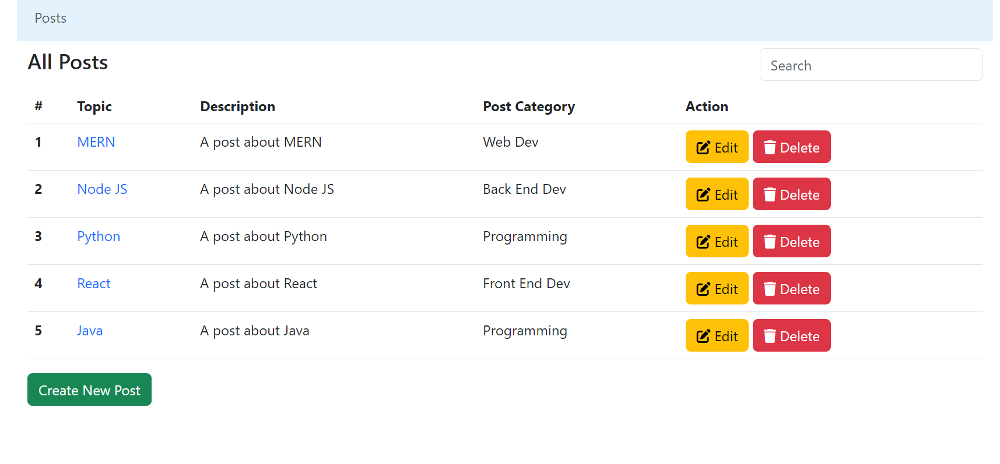
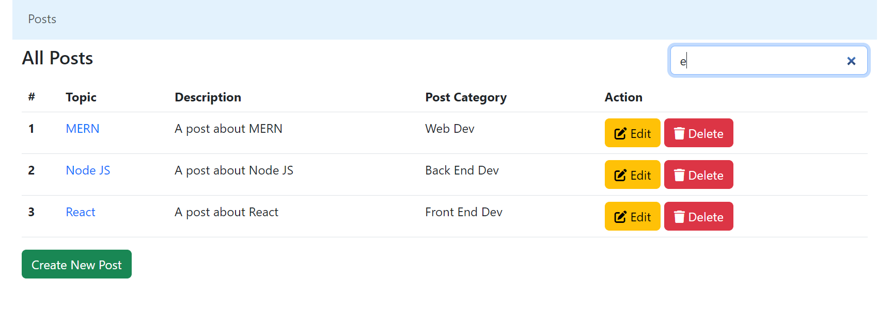
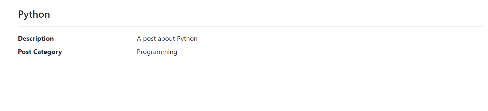
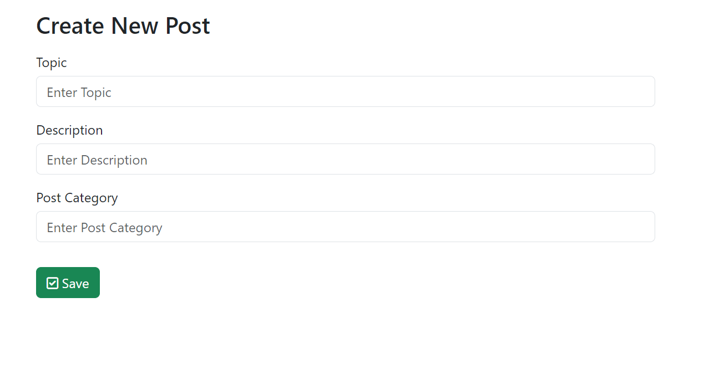

# Mern-Stack-Demo-Project

MERN Stack stands for MongoDB, Express, React, Node.js and this combined stack is known as MERN stack.
- MongoDB	: A document-oriented database programme based on NoSQL.
- Express	: It’s a robust Node.js web application framework that helps in creating powerful REST APIs.
- React	: A JavaScript library used to create beautiful and interactive user interfaces developed by Facebook and the community of individual developers.
- Node : It’s a JavaScript runtime environment built on Google Chrome’s V8 engine, and it compiles js at the runtime.

This project followes the youtube tutorial at <https://youtube.com/playlist?list=PLvfC6i-hEZBnqqF7giszuYI0iqenU5NY0>

"mernCrud_v1" folder contains project files upto playlist video part 4
"mernCrud_v2" folder contains final project files

## Features
- Post model has a topic,decription and a category.
- Has implemented GET,POST,PUT,DELETE APIs for posts.
- All data are saved in mongoose atlas db.
- Show the data in the frontend.
- Run both server(js) & cliend(react app) at the same time using concurrently.
- Use bootstrap and font awesome to make the user interface friendly.
- Navigation bar to return to homepage.
- Can Create,Read,Edit,Delete posts from user interface.
- Implemented Routes for Create Post, Raed Post, Edit Post, Home, Navigation Bar using react-router-dom.
- Search bar to capture search inputs and filter user interface. (no case sensitivity)

Homepage

Search Posts

View a Specific Post

Edit a Specific Post

Create a New Post

